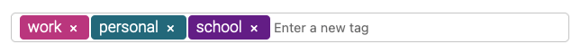

# React Tag Input



A lean, easily customizable, tag input React component.

## Installation

```shell
npm i @eidellev/react-tag-input

# or
yarn add @eidellev/react-tag-input
```

## Usage

### Import styles

```css
/* In your stylesheet */
@import '@eidellev/react-tag-input/dist/index.css';
```

### Import component

```jsx
import TagInput from '@eidellev/react-tag-input';
...

<TagInput value={tags} onChange={onChange} colorize placeholder="New Tag" options={suggestions} />
```

## Props

- `value`(string[]) - The current value
- `options`(string[]) - A list of suggestions
- `colorize`(boolean) - Should each tag be assigned a unique background color
- `placeholder`(string) - Placeholder text
- `completeKeys`(string[]) - A list of keys that trigger tag completion (the default are `Esc`, `Enter` and `,`)
- `onChange`(function) - A callback that will be called when a tag is added or removed

## Customizing Styles

If you would like to apply your own design, there is no need to import the default styles. Simply add your own styles to the built-in classes:

```css
.tag-input {
  /* ... */
}

.tag-input .tag {
  /* ... */
}

.tag-input .tag .remove-tag-button {
  /* ... */
}

.tag-input .new-tag {
  /* ... */
}
```

For example, this is how we can style the component with [TailwindCSS](https://tailwindcss.com/):

```css
.tag-input {
  @apply w-full bg-white rounded border border-gray-300  focus-within:border-purple-500 focus-within:ring-2 focus-within:ring-purple-200 text-base outline-none py-1 px-3 leading-8 transition-colors duration-200 ease-in-out text-white;
}

.tag-input .tag {
  @apply px-2 py-1 rounded-md mr-2;
}

.tag-input .tag .remove-tag-button {
  @apply ml-2;
}

.tag-input .new-tag {
  @apply focus:border-0 focus:outline-none text-gray-700;
}
```


